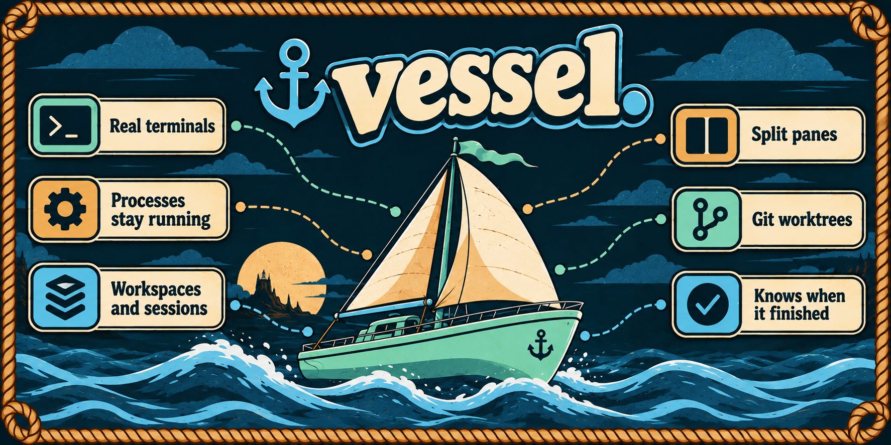

# Vessel



A local-first desktop terminal and session manager. Real shells, kept together by the work they belong to, running whether or not the window is open. Tauri 2, React, TypeScript, xterm.js and a Rust PTY daemon.

Vessel runs arbitrary CLI programs. It is not an AI agent or an orchestrator.

[](https://github.com/matheuscavin/vessel/actions/workflows/ci.yml)

## What you get

- Real system shells over the OS PTY, or ConPTY on Windows. No emulation, no simulated output.
- A detached daemon owns every process, so closing the window leaves your work running and reopening reattaches to it.
- Workspaces hold sessions, sessions hold terminals. A session is a directory, a repository, or a Git worktree it creates for you.
- Terminal tabs, and panes that nest in either direction with their proportions saved per session.
- A mark on the tab, the session and the workspace when a command finishes while you were elsewhere, with an optional sound.
- Local files only: human-readable TOML configuration and a JSON state file under your platform's configuration directory. Nothing leaves the machine.

## Install

There is no prebuilt release yet, so you build it once and copy the result where you keep your applications. Most of the few minutes it takes is Rust compiling.

**Prerequisites**

- Node 22 or newer, to build the interface. The finished application does not need Node.
- A stable Rust toolchain, through [rustup](https://rustup.rs).
- Git, for the repository and worktree features.
- The [Tauri platform prerequisites](https://v2.tauri.app/start/prerequisites/) for your system. Linux additionally needs WebKitGTK 4.1; Windows uses the system WebView2.

**Build**

```sh
git clone https://github.com/matheuscavin/vessel.git
cd vessel
npm ci
npm run desktop:build
```

**macOS**

```sh
cp -R target/release/bundle/macos/Vessel.app /Applications/
open -a /Applications/Vessel.app
```

For the application bundle alone, without a disk image: `npm run desktop:build -- --bundles app`.

The build is unsigned and not notarized, so macOS refuses the first open. Right click the application and choose **Open**, or clear the quarantine attribute yourself:

```sh
xattr -dr com.apple.quarantine /Applications/Vessel.app
```

Unsigned builds also get a fresh identity on every rebuild, so macOS asks again for any privacy permission you had granted.

**Linux and Windows**

The same command writes the native packages under `target/release/bundle/`: `deb`, `rpm` and `AppImage` on Linux, `msi` and `nsis` on Windows.

**Updating**

Pull, rebuild, and replace the installed application. Vessel compares the daemon's executable with its own when it starts and replaces a daemon left running by an earlier build. That ends the terminals the old daemon owned; workspaces, sessions and terminal metadata survive and come back as **Start terminal**.

## Tutorial

**1. Make a workspace.** One per company, client or personal context. The workspace tabs sit along the top; **+** adds one, double click renames it and gives it a color.

**2. Make a session.** `Mod+N`, or **New session** in the sidebar. Give it a name and a directory. `~` and `~/...` work, and paths autocomplete as you type: arrows to move, Tab or Enter to complete. If the directory is a Git repository, Vessel detects it and offers three ways in:

- **Use directory**, to work in the repository as it is.
- **New worktree**, to create a worktree and a branch for this session. Vessel runs `git worktree add` for you.
- **Existing worktree**, to attach to one you already have.

`Mod+Shift+N` skips the dialog and opens a session in your home directory.

**3. Open a terminal.** `Mod+T`. It is a real shell: colors, Unicode, mouse, alternate screens, and resize handled through the OS PTY. `Mod+1` through `Mod+9` jump between tabs, and dragging a tab reorders it.

**4. Split the view.** From the terminal actions menu, or `Mod+Shift+Right` and `Mod+Shift+Down`. Panes nest as deep as you like in either direction, dividers drag to resize, and the proportions are saved with the session. **Show terminals as tabs** collapses back.

**5. Walk away from a long command.** When it finishes, its tab, its session and its workspace carry a mark until you look at it. Vessel reads this from the PTY's foreground process group, so nothing needs shell integration and anything you run counts. Settings → **Notifications** holds the switch and the duration threshold, which hides commands too short to have lost your attention.

A tool that stays open between turns, such as Claude Code or Codex, never hands the terminal back and so never finishes a command. It rings the terminal bell instead, which is marked the same way and ignores the threshold.

**6. Turn on a sound.** Settings → **Sounds**: pick Chime, Ping or Knock, set the volume, and preview it. The terminal you are looking at stays silent; a sound is for the ones you are not. One wait shared by every terminal keeps a program that rings in a loop from becoming a siren.

**7. Copy without the wrapping.** A program that wraps its own output, as Claude Code does, hands the terminal one row per line, and nothing in the stream says which breaks it meant. Settings → Terminal → **Copy wrapped rows as whole lines** rejoins the rows the following word could not have fitted on, and leaves lists, quotes, headings and short lines alone. Off by default: the join is inferred, never recorded.

**8. Close the window.** The daemon keeps your shells running. Reopen Vessel and it reattaches. Closing a terminal explicitly ends its process, and after a daemon or machine restart saved terminals wait as **Start terminal** rather than silently rerunning anything.

Deleting a session or a workspace, from the × on its row or from the command palette, ends the terminals inside it and leaves every repository and worktree on disk alone.

**Shortcuts.** `Cmd` on macOS, `Ctrl` on Windows and Linux. All of them are configurable in Settings.

| Shortcut | Action |
| --- | --- |
| Mod+N | New session |
| Mod+Shift+N | Quick session |
| Mod+T | New terminal |
| Mod+W | Close terminal |
| Mod+1…9 | Select terminal |
| Mod+Shift+Right / Down | Split right / down |
| Mod+Shift+P | Command palette |
| Mod+Shift+R | Rename session |
| Mod+Alt+Down | Next session |
| Mod+Alt+Right | Next workspace |
| Mod+, | Settings |

Six themes coordinate the terminal and application colors. Font family, size, line height, scrollback and the shell executable are configurable.

## Platform support

| Platform | State |
| --- | --- |
| macOS | Built and used daily. Full suite green in CI, including real PTY and browser integration. |
| Linux | Full suite green in CI, real PTY included. The desktop build has not been exercised by hand. |
| Windows | Builds, and everything that does not need a terminal passes in CI. Terminal behavior is **unverified**: the CI image delivers no pseudoconsole output to a reading process, not even for the spawn Microsoft documents with no crate in the way, so those tests skip there and say so. `crates/vessel-core/tests/conpty_spawn.rs` is the probe; run the suite on a real machine to exercise it. |

## How it works

```text
React: metadata, navigation, commands, preferences
  └─ xterm.js: imperative byte writes, WebGL for the visible terminal
       └─ Tauri Rust bridge: commands and raw binary responses
            └─ authenticated, loopback-only daemon protocol
                 └─ native PTY or ConPTY, process lifecycle, bounded output
```

The desktop binary launches a separate copy of itself with `--daemon`, detached from the window. The daemon owns the PTYs and the child processes; React mounting and unmounting never spawns or kills anything. `vessel-daemon` also runs on its own: `cargo run -p vessel-core --bin vessel-daemon`.

Each terminal keeps a 1 MiB volatile byte ring and a VT screen snapshot. Readers take at most 32 KiB at a time and acknowledge offsets, so the PTY reader can apply backpressure before unconsumed bytes leave the ring; a reader idle for two seconds is dropped from that accounting, so a closed window cannot block a process forever. Reattaching restores the visible screen, not the full scrollback.

Platform concerns sit behind `PtyBackend`, `ShellProvider`, `PathProvider` and `ProcessProvider`. Shell startup passes a system-variable allowlist; explicit program launches take an executable and argv, never interpolated shell text; Git always takes argument arrays. The local protocol is documented in [docs/protocol.md](docs/protocol.md), and what is and is not implemented in [docs/milestone.md](docs/milestone.md).

## Files and privacy

`config.toml` and `state.json` live in your platform's configuration directory, and Settings → Advanced shows the exact path: `~/.config/vessel` on Linux, `~/Library/Application Support/dev.vessel.Vessel` on macOS, the roaming application data directory on Windows. `VESSEL_DATA_DIR` points an instance somewhere else, which is what the tests use.

Saved state is names, directories, branches, ordering and selections. Terminal output, command arguments and arbitrary environment variables are never written down. The daemon endpoint is owner-only on Unix and relies on the profile directory ACL on Windows, so do not point `VESSEL_DATA_DIR` at a shared directory. Workspace separation is organization and environment hygiene, not an OS sandbox: your shell startup files and the programs you run can still load secrets and write history of their own.

## Development

```sh
npm ci
npm run desktop          # the app, with a detached daemon
npm run dev              # UI preview only, deliberately without terminals
```

```sh
npm run test:unit        # layout and copy rejoining
cargo test -p vessel-core
cargo clippy --workspace --all-targets -- -D warnings
cargo fmt --all --check
cargo build -p vessel-core && npx playwright install chromium && npm test
```

The Rust integration tests launch a real daemon and drive real PTYs: input, resize, reattach, true color, Unicode, alternate screens, an actual Vim edit and save, explicit program launch, process exit, metadata restored across a daemon restart, environment filtering, workspace ownership, Git worktrees, finished-command marks and the terminal bell.

`npm test` puts a Chromium in front of that same daemon, replacing only Tauri's transport, never the PTYs. It covers creation, real input, tabs, renaming, reload and reconnect, preferences, the palette, nested panes without remounting, divider drags, the sound settings, finished-command marks and deletion. It writes screenshots to `docs/screenshots`, which are generated locally and not kept in the repository.
